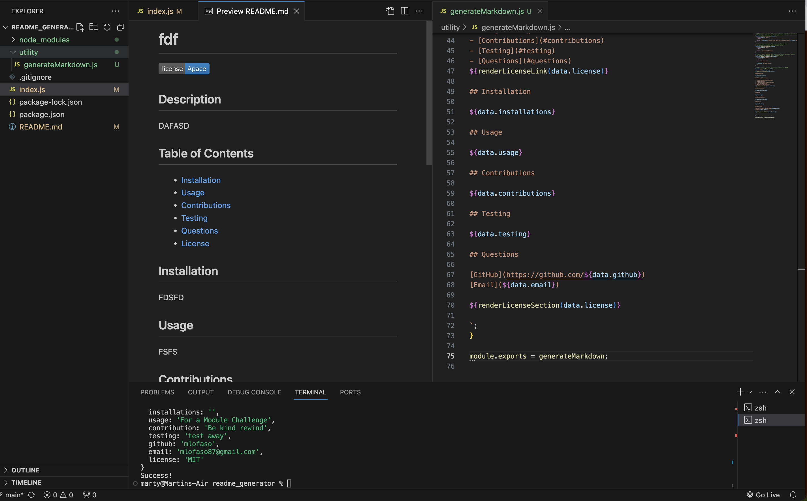

# Marty's README

## Description 

README Generator

## Table of Contents

- [Installation](#installation)
- [Usage](#usage)
- [Contributions](#contributions)
- [Testing](#testing)
- [Questions](#questions)
- [License](#license)

## Installation

Inquirer

## Usage

to generate READMEs

## Contributions

undefined

## Testing

open the terminal and type node index

## Questions 

[GitHub](https://github.com/mlofaso)
[Email](mlofaso87@gmail.com)

## License 

  MIT has been chosen
  

